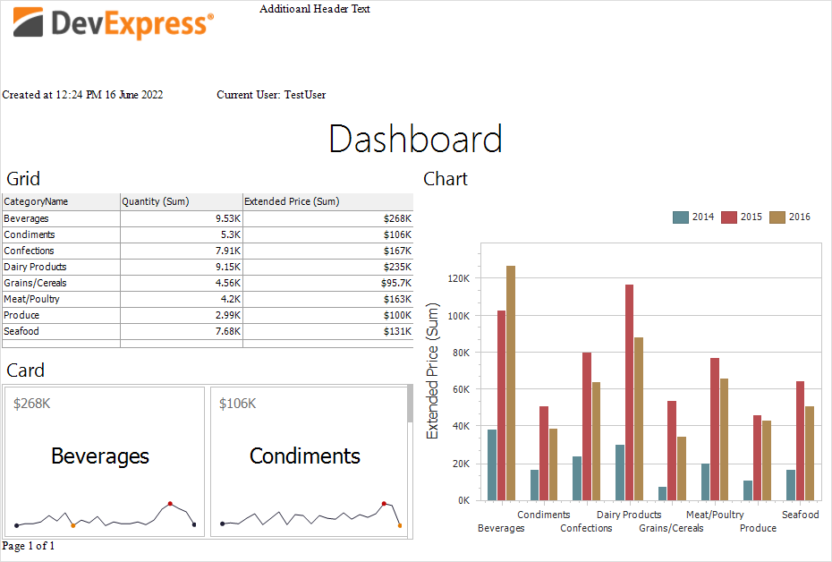

<!-- default badges list -->

<!-- default badges end -->

# Dashboard for Web Forms - How to add custom information to the exported dashboard

The following example shows how to specify header and footer content of an exported dashboard. For this, handle the [ASPxDashboard.CustomExport](https://docs.devexpress.com/Dashboard/DevExpress.DashboardWeb.ASPxDashboard.CustomExport) event. This event provides access to the underlying [report](https://docs.devexpress.com/XtraReports/DevExpress.XtraReports.UI.XtraReport) of the exported document.

## Files to Look At

* [Default.aspx](./CS/WebDashboard_CustomExport/Default.aspx) (VB: [Default.aspx](./VB/WebDashboard_CustomExport/Default.aspx))
* [Default.aspx.cs](./CS/WebDashboard_CustomExport/Default.aspx.cs) (VB: [Default.aspx.vb](./VB/WebDashboard_CustomExport/Default.aspx.vb))

## Documentation

- [Exporting in the Web Dashboard](https://docs.devexpress.com/Dashboard/116694/web-dashboard/create-dashboards-on-the-web/exporting?p=netframework)

## More Examples

- [Dashboard for Web Forms - How to add custom information to the exported Excel document](https://github.com/DevExpress-Examples/web-dashboard-how-to-add-custom-information-to-the-exported-excel-document-t504794)
- [Dashboard for WinForms - How to add custom information to the exported dashboard](https://github.com/DevExpress-Examples/winforms-dashboard-how-to-add-custom-information-to-the-exported-dashboard-t466558)
